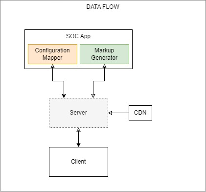

# POC Details
Monorepo for POC containing below two apps

### 1. Simple App
Documentation can be found [here](packages/simple-app/README.md) 

### 2. S-O-C (Separation of concern)
Documentation can be found [here](packages/soc/README.md) 


## Data flow
 


## How to run 
**Start**
```
npm install
npm run bootstrap
npm start
```

**Build**
To generate package of Simple App for pushing it to SOC app.    
```
npm run build
```
**Please Note:** : SOC App should be running before posting the JS generated through `npm run build`.
